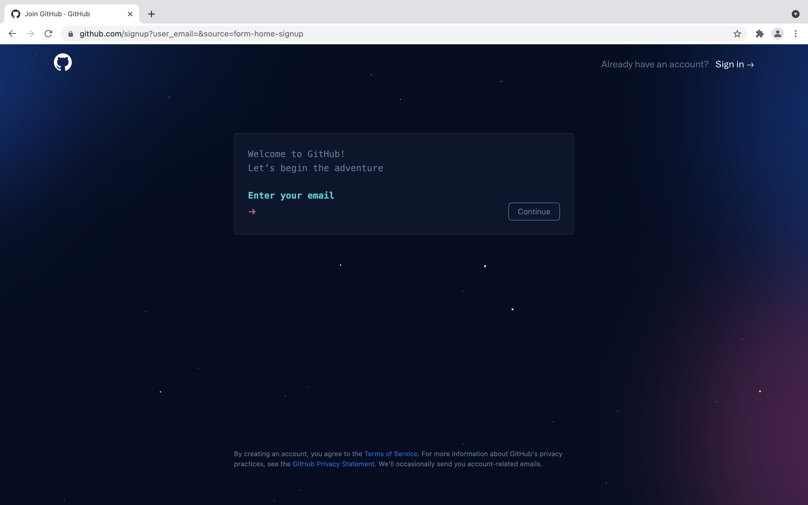
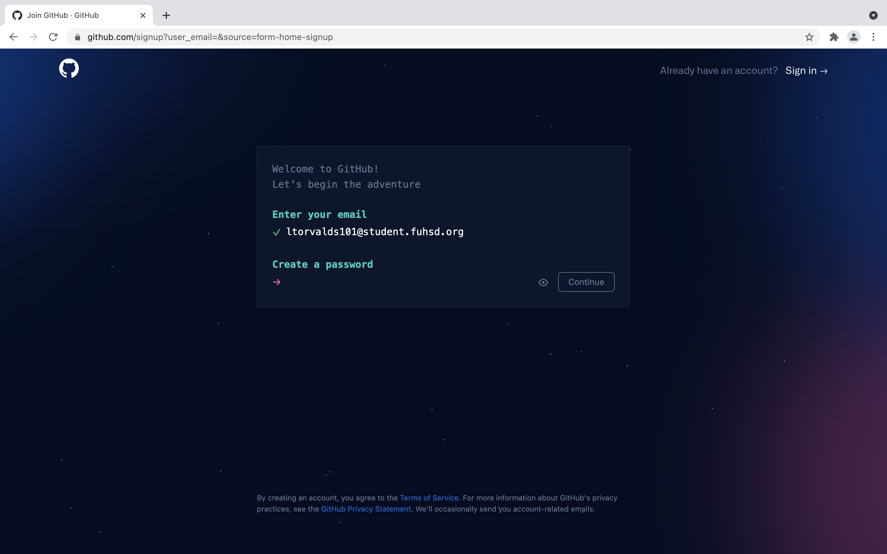
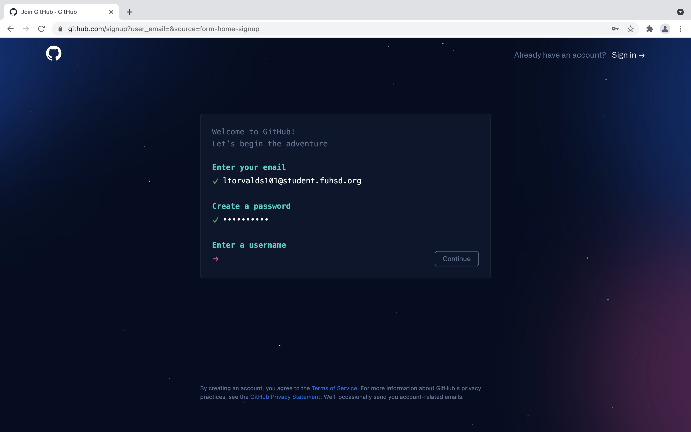
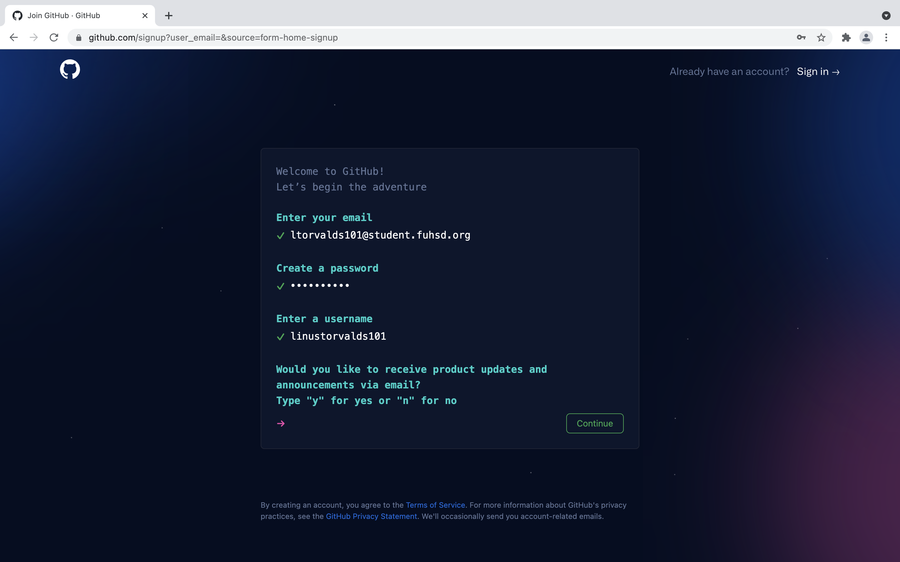
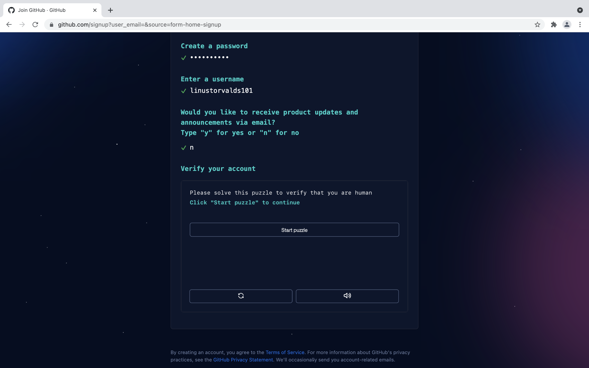
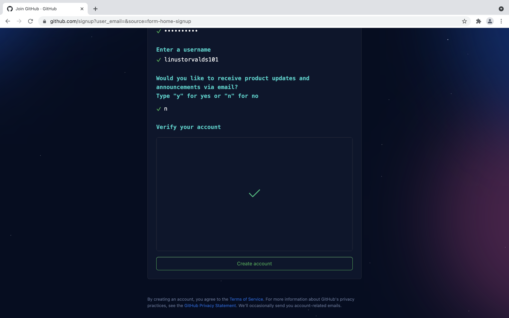
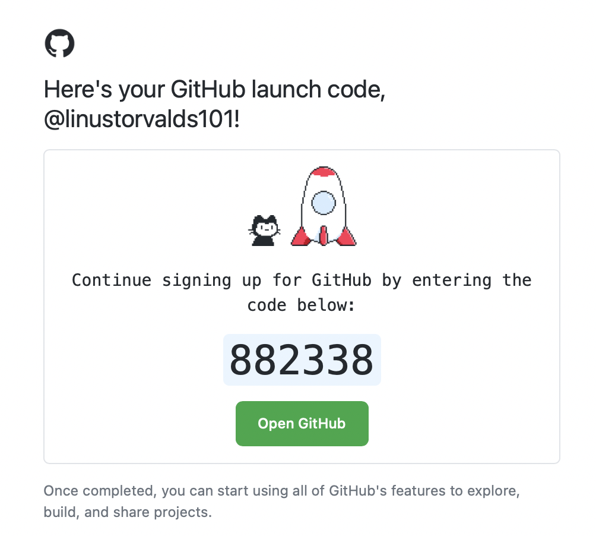
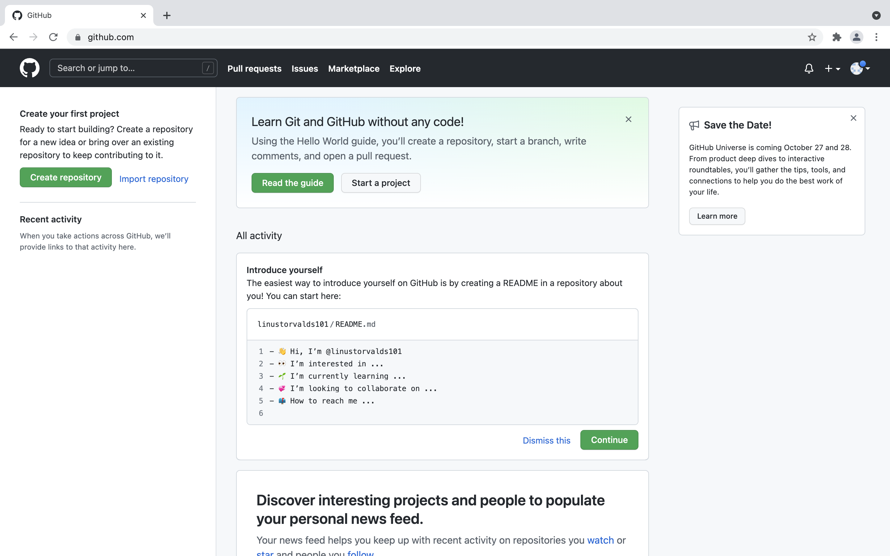

# HHS GitHub Quickstart

## Table of Contents

1. [Introduction](#introduction)
1. [Creating A Github Account](#creating-a-github-account)
1. [Downloading GitHub Desktop](#downloading-github-desktop)
1. [Accepting an Assignment](#accepting-an-assignment)
1. [Cloning a Repository](#cloning-a-repository)
1. [Importing a Project into Eclipse](#importing-a-project-into-eclipse)
1. [Making a Commit](#making-a-commit)
1. [Pushing Changes to GitHub](#pushing-changes-to-github)

## Introduction

GitHub is a platform that allows you to store your code in the cloud and easily keep track of the changes that you make. You can think of it like Google Docs, but built specifically for developers like you! In this quickstart, you'll learn the essentials needed to get you up and started using GitHub for this class

> **Fun Fact:** We're using GitHub right now to host and version control this quickstart guide! Feel free to [check us out](https://github.com/nsudhakaran679/hhs-github-quickstart) there!

## Creating a GitHub Account

To get started with GitHub, you need to create an account. Open [github.com](https://www.github.com) in your browser and it should take you to a page that looks like this:

From here, click on the big green button saying "Sign up for GitHub". It should redirect you to a page asking for your email.

Enter your **school email** and click continue.

> **Note:** Your school email is your "_first initial_ + _first ten letters of your last name_ + _last three digits of your student ID_" at _student.fuhsd.org_. For example, if your name was Linus Torvalds, and your Student ID was 1100101, your email would be *ltorvalds101@student.fuhsd.org*

Enter in any password that you like as long as you'll be able to remember it for later use! Then, click continue.

> **Note:** Make sure your password is secure! GitHub requires your passwords to have at least 15 characters or at least 8 characters including a number and a lowercase letter.

Enter in your username in the format "_first name_ + _last name_ + _last three digits of your Student ID_". After you're finished, click continue.

> **Note:** Your GitHub username must be unique, meaning that nobody else who uses GitHub can have your username. In the case that somebody does have your username, try a variarion of the suggested username format as long as it at least includes the information in your email. For example, you could try using your full Student ID instead of just the last three digits.

GitHub is now asking you whether or not you want to recieve promotional emails from them. You're welcome to do whatever you'd like here, so type "n" if you don't want such emails and "y" if you do.

Before you can complete your account creation, you need to solve a simple puzzle to verify you aren't a robot. Click the "Start puzzle" button and complete the puzzle.

> **Note:** This puzzle will vary for everyone, so just click the "Start puzzle" button and follow the instructions you are given.

We're almost finished creating your GitHub account! Now that you've entered in all of your information, click the big "Create account" button.

Now you need to verify your email by entering in the code sent to your inbox. Open your school email in a new tab, and then find the verification code email.

From here you have two options: You can either return to the tab you were just in previously and enter in the given code, or you can click the big green "Open GitHub" button in the email.

> **Note:** If you can't find the email, try looking for emails from noreply@github.com or emails with the subject "🚀 Your GitHub launch code".

Either way, you should be taken to your GitHub dashboard. Congratulations! You've created your very own GitHub Account. You're now ready to move on to the next step which is [Downloading GitHub Desktop](#downloading-github-desktop).

## Downloading GitHub Desktop

## Accepting an Assignment

## Cloning a Repository

## Importing a Project into Eclipse

## Making a Commit

## Pushing Changes to GitHub
