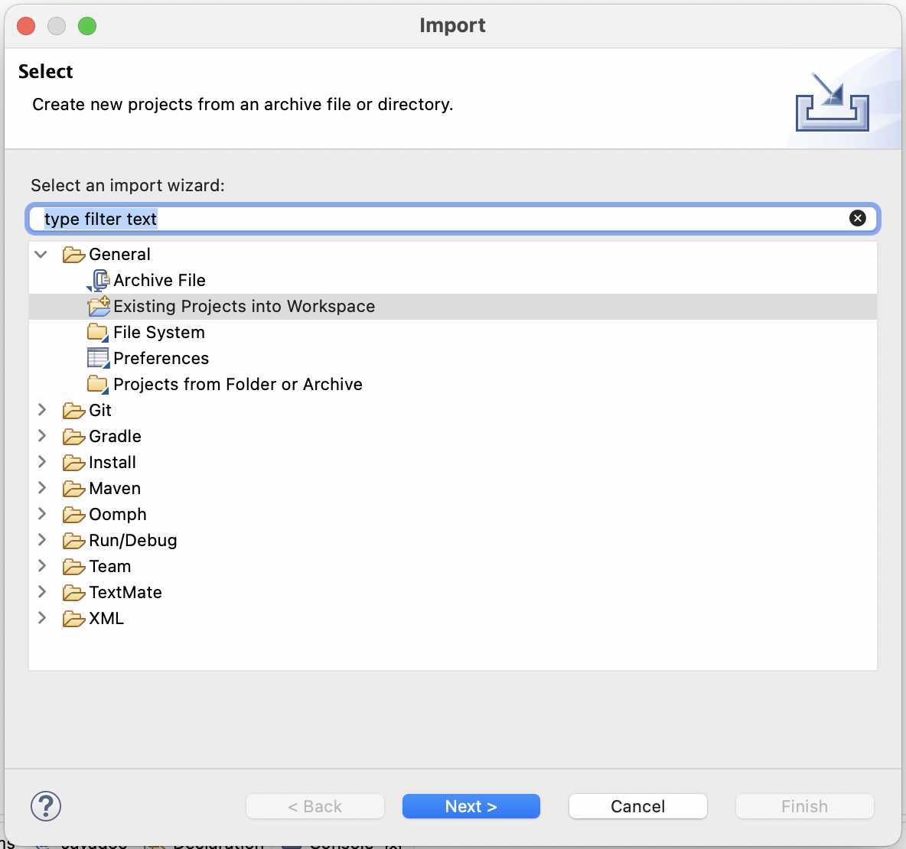

# HHS GitHub Quickstart

The official Homestead High School GitHub Quickstart Guide by the wonderful TAs: Rohan Parikh and Neel Sudhakaran.

## Table of Contents

1. [Introduction](#introduction)
1. [Creating A Github Account](#creating-a-github-account)
1. [Accepting an Assignment](#accepting-an-assignment)
1. [Downloading GitHub Desktop](#downloading-github-desktop)
1. [Cloning a Git Repository](#cloning-a-git-repository)
1. [Import a Project into Eclipse](#import-a-project-into-eclipse)
1. [Making a Git Commit](#making-a-git-commit)
1. [Pushing Changes to GitHub](#pushing-changes-to-github)
1. [Conclusion](#conclusion)

# Introduction

GitHub is a platform that allows you to store your code in the cloud and easily keep track of the changes that you make. You can think of it like Google Docs, but built specifically for developers like you! In this quickstart, you'll learn the essentials needed to get you up and started using GitHub for this class

> **Fun Fact:** We're using GitHub right now to host and version control this quickstart guide! Feel free to [check us out](https://github.com/nsudhakaran679/hhs-github-quickstart) there!

## Creating a GitHub Account

To get started with GitHub, you need to create an account. Open [github.com](https://www.github.com) in your browser and it should take you to a page that looks like this:

From here, click on the big green button saying "Sign up for GitHub". It should redirect you to a page asking for your email.

Enter your **school email** and click continue.

> **Note:** Your school email is your "_first initial_ + _first ten letters of your last name_ + _last three digits of your student ID_" at _student.fuhsd.org_. For example, if your name was Linus Torvalds, and your Student ID was 1100101, your email would be *ltorvalds101@student.fuhsd.org*

Enter in any password that you like as long as you'll be able to remember it for later use! Then, click continue.

> **Note:** Make sure your password is secure! GitHub requires your passwords to have at least 15 characters or at least 8 characters including a number and a lowercase letter.

Enter in your username in the format "_first name_ + _last name_ + _last three digits of your Student ID_". After you're finished, click continue.

> **Note:** Your GitHub username must be unique, meaning that nobody else who uses GitHub can have your username. In the case that somebody does have your username, try a variation of the suggested username format as long as it at least includes the information in your email. For example, you could try using your full Student ID instead of just the last three digits.

GitHub is now asking you whether or not you want to receive promotional emails from them. You're welcome to do whatever you'd like here, so type "n" if you don't want such emails and "y" if you do.

Before you can complete your account creation, you need to solve a simple puzzle to verify you aren't a robot. Click the "Start puzzle" button and complete the puzzle.

> **Note:** This puzzle will vary for everyone, so just click the "Start puzzle" button and follow the instructions you are given.

We're almost finished creating your GitHub account! Now that you've entered in all of your information, click the big "Create account" button.

Now you need to verify your email by entering in the code sent to your inbox. Open your school email in a new tab, and then find the verification code email.

From here you have two options: You can either return to the tab you were just in previously and enter in the given code, or you can click the big green "Open GitHub" button in the email.

> **Note:** If you can't find the email, try looking for emails from noreply@github.com or emails with the subject "🚀 Your GitHub launch code". Check your spam folder!

Either way, you should be taken to your GitHub dashboard. Congratulations! You've created your very own GitHub Account. You're now ready to move on to the next step which is [accepting an assignment](#accepting-an-assignment).

## Accepting an Assignment

When you're using GitHub all of your project code and changes live inside something called a repository. Although you can create a repository from scratch, for this class you're mostly going to be coding using pre-created repositories given by your teacher.

To find the given repository for an assignment, start by opening up your main class page in Schoology.

Now, open up your given lab folder.

> **Note:** You may not see your lab folders in the top level view in Schoology because they might be nested inside various sub folders.

Double click on the [classroom.github.com](https://classroom.github.com) link inside the folder.

> **Note:** You likely have more stuff inside the lab Schoology folder, as this is a simplified version created for this demo.

GitHub Classroom is now asking if you want to accept this assignment. Click the big green button that says "Accept assignment".

If you're at this point, GitHub is now creating your project repository for you. Wait a second and then reload the page (the keyboard shortcuts are `Ctrl + R` on Windows and `Cmd + R` on a Mac.)

You're almost ready to go! The last step now is to click on the link, and it will take you to your newly created assignment repository!

> **Note:** Your assignment repository link should have the following structure: "[github.com/HHS-Intro-To-Programming-2021-22-Taylor/](https://github.com/HHS-Intro-To-Programming-2021-22-Taylor/) + _the lab name_ + _your GitHub username_"

Congratulations! You've now created your lab repository and can get started working on your lab! Move on to the next step which is [downloading GitHub Desktop](#downloading-github-desktop).

## Downloading GitHub Desktop

Now that you've gotten your repository set up in GitHub, you need some way of accessing it on your local machine. The easiest way to get started with this is another GitHub tool, GitHub Desktop.

To get started, go to [desktop.github.com](https://desktop.github.com).

Depending on whether you're on a Windows machine or on a Mac, click the big purple "Download for Windows (64bit)" button or the "Download for macOS". Or alternatively, use these links to download the [Windows version](https://central.github.com/deployments/desktop/desktop/latest/win32) and the [MacOS version](https://central.github.com/deployments/desktop/desktop/latest/darwin).

> **Note:** If you are working on an Apple Silicon Machine, there's a special link to download for [the native M1 build](https://central.github.com/deployments/desktop/desktop/latest/darwin-arm64).

Then, download as normal.

## Cloning a Git Repository

Now that we've downloaded GitHub Desktop, let's use it to access our assignment repository on our local machine. The process to do this is called **cloning**, as we're making a clone of the **remote** repository (the one on GitHub) to have access to it locally.

Start by pulling up your assignment repository on GitHub.

Click on the big green button saying "Code" and it should pull up a dropdown menu like the picture below.

Click on the option that says "Open with GitHub Desktop" and it should prompt you to open GitHub Desktop.

Click "Open GitHub Desktop" and it should open GitHub Desktop with the following prompt:

Click the big blue "Clone" button, and GitHub Desktop should bring you to your a page specifically meant for your current lab.

Congratulations! If you've gotten to this page, it means you've successfully cloned your lab repository to your local machine. Continue to the next step to learn how to [import a project into Eclipse](#import-a-project-into-eclipse).

## Import a Project into Eclipse

Having our project on out local machine is useless unless we can access the code in our IDE, Eclipse.

Start by opening up your Eclipse workspace.

> **Note:** You likely have more projects in your workspace, we just created this one as a demo.

Now, go to the Eclipse menu bar and click "Import" within the "File" dropdown menu.

Once you click import, you should see a popup that prompts you to import a project.

Click "Existing Projects into Workspace" and then hit the blue button that says "Next".

You should be taken to a page that asks you to select the root directory for your projects. By default, GitHub Desktop stores your projects inside a GitHub folder in the Documents directory. Hit browse and locate that folder.

> **Note:** If you've modified the default directory for GitHub desktop like we have in the example, navigate to that directory instead.

Once you do that, Eclipse will automatically find and select any projects within your GitHub directory that have not already been imported into Eclipse. To import them, simply click the blue "Finish" button.

Congratulations! If the project you wanted to import into Eclipse is shown inside the Package Explorer, you've successfully completed this step! Continue on to learn [how to make a git commit](#making-a-git-commit).

## Making a Git Commit

Say you make a bunch of changes to your project and add a whole bunch of new functionality. You can save the individual files within this project, but there is no real way to save a snapshot of the current version of your project and also no way to rollback to a previous version in case you need to. To fix this issue, git has the concept of commits. Each commit is essentially a snapshot of changes that you have made, and you can easily view a history of your commits as well as rollback to a previous commit if necessary.

To make your first commit, make sure you have made changes to your project using Eclipse. Then open up GitHub Desktop to your project repository.

In the bottom right hand corner of the screen, you should see the form inputs asking for a "Summary (required)" and "Description". These are respectively the "Summary" and "Description" values of the commit. Now, enter in your commit summary value into the text input. The commit summary should be an overall title for your commit. If you want, you may enter in a more detailed description into its text input.

> **Note:** A good commit summary format is the "_Date_ + Commit + #_Commit Number_". For example, following this format, the first commit I make on October 31 would be called "10/31 Commit #1"

Once you've done that, click the big blue "Commit to main" button.

You should see a screen like the one above, where in the "Changes" tab in the sidebar it says "0 changed files". Just to double check though, click on the "History" tab in the sidebar.

If the commit you made is at the top of the commit history in the "History" tab, you've successfully completed this step! Congratulations, you can now learn how to [push your local changes to GitHub](#pushing-changes-to-github).

## Pushing Changes to GitHub

Now that you've made a commit to your local repository, we need to sync these changes to GitHub. We call this action "pushing" our code.

To push your changes to GitHub navigate back to the "Changes" tab in GitHub Desktop sidebar.

Click the big blue "Push origin" button in the middle of the screen.

If the prompt to push your commits is gone, you've successfully pushed your code to GitHub! As an extra precaution though, take a look at the "Fetch Origin" tab in the header. If it says "Last fetched just now", you've completed everything!

## Conclusion

Congratulations! You've now finished every step in the GitHub Quickstart. However, keep it close by in case you ever need to look back through the guide as a reference. Happy Coding!
